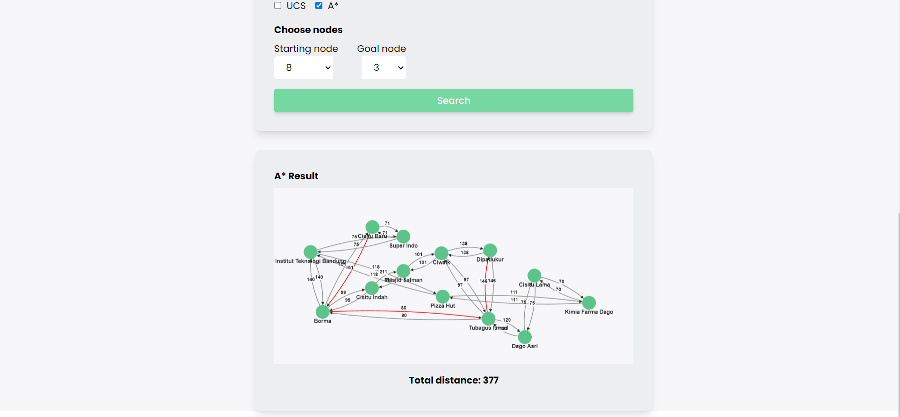
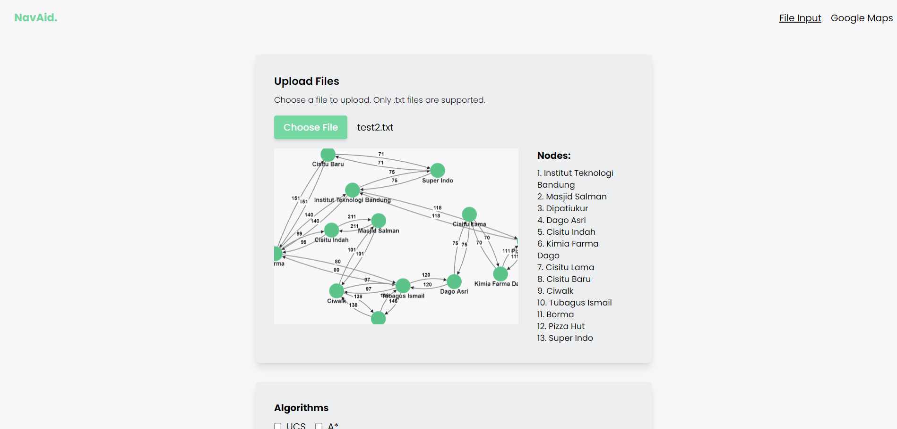
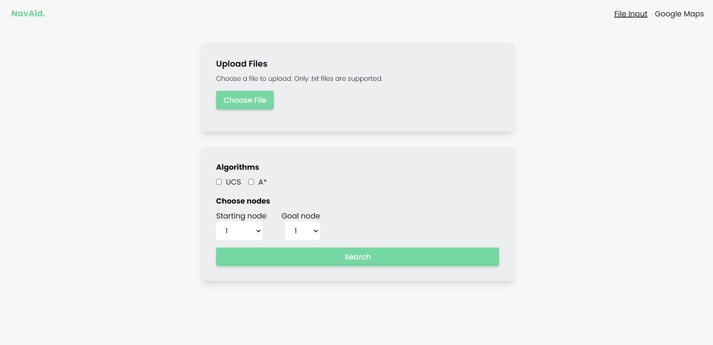
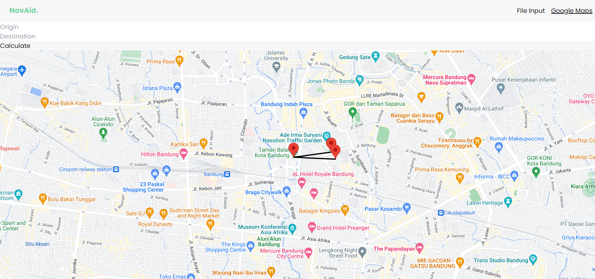

# Tucil3_13521094_13521139
## Implementasi Algoritma UCS dan A* untuk Menentukan Lintasan Terpendek dengan Javascript

## **Table of Contents**
* [General Information](#general-information)
* [Requirements](#requirements)
* [How to Run](#how-to-run)
* [Screenshot](#screenshot)
* [Author](#author)

## **General Information**
Algoritma UCS (Uniform cost search) dan A* (atau A star) dapat digunakan untuk menentukan lintasan terpendek dari suatu titik ke titik lain. Program ini dapat menerima graf yang merepresentasikan peta kemudian mencari lintasan terpendek antara simpul asal dan tujuan menggunakan UCS atau A*.

## **Requirements**
Untuk menggunakan program ini, Anda harus install *npm* pada perangkat yang digunakan. 

## **How to Run**
### **Setup**
1. Clone repository <br>
```sh 
$ git clone https://github.com/liviaarumsari/Tucil3_13521094_13521139.git
```
2. Buka repository pada terminal

### **Run**

1. Ganti directory ke aplikasi dengan perintah berikut <br>
```sh 
$ cd src/navaid
```
2. Lakukan instalasi terhadap dependencies aplikasi
```sh 
$ npm install
```
3. Jalankan aplikasi
```sh 
$ npm start
```


## **Screenshot**






## Authors

|  **NIM** |        **Nama**       |
|:--------:|:---------------------:|
| 13521094 | Angela Livia Arumsari |
| 13521139 | Nathania Calista      |